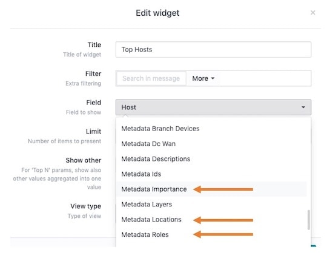

# TSV2Meta

This script will take in a tab separated file and convert the entries to a LogZilla rule in JSON format

## Input fields

The `.tsv` file should contain columns for:

* matchField - The field to match on, such as `host`, `program`, `message`, etc.
* matchValue - the value of the match field such as `my.host.com` or `1.2.3.4` if you are matching on `host` (from the `matchField` specified above)
* key - set the MetaTag key, for example: `DeviceID`
* value - set the value you want to assign to the `key`, for example: `rtp-core-sw`
* addtag - indicate whether or not a tag should also be created for this key/value pair


## Usage

```
cat test.tsv | ./tsv2meta
```

This will generate a minified `.json` rule, for example:

```
{"rewrite_rules":[{"match":[{"value":"SW1-VLAN10","op":"=~","field":"host"}],"tag":{"ut_meta_deviceid":"rtp-core-sw"},"update":{"message":"$MESSAGE DeviceID=\"rtp-core-sw\""}},{"comment":["Description: RTP Core Layer2"],
...(truncated for brevity)

```

To help make the result more readable, install `jq` on your system. For example, on an Ubuntu server, just type:

```
sudo apt install jq
```
This will allow you to "prettify" the output from the conversion, for example:


```
# cat test.tsv | ./tsv2meta | jq .

{
  "rewrite_rules": [
    {
      "match": [
        {
          "value": "SW1-VLAN10",
          "op": "=~",
          "field": "host"
        }
      ],
      "tag": {
        "ut_meta_deviceid": "rtp-core-sw"
      },
      "update": {
        "message": "$MESSAGE DeviceID=\"rtp-core-sw\""
      }
    },
...(truncated for brevity)
```

### Use Case Sample
As a practical example, let's say we wanted to match on all incoming events that have a host name of `1.1.1.2`

We want to create a rule to add the following meta keys and values, but we **only want user tags** created for:

* DeviceImportance
* DeviceLocation
* DeviceRole

```
DeviceID="rtp-core-sw"
DeviceDescription="RTP Core Layer2"
DeviceImportance="High"
DeviceLocation="Raleigh"
DeviceLayer="L2"
DeviceRole="Core"
DeviceContact="support@logzilla.net"
```
Create a tab separated file called `myfile.tsv` with the following entries:
> <font color="red"> IMPORTANT: </font> replace the word `<TAB>` with an actual tab in your file.

```
host<TAB>1.1.1.2<TAB>DeviceID<TAB>rtp-core-sw<TAB>0
host<TAB>1.1.1.2<TAB>DeviceDescription<TAB>RTP Core Layer2<TAB>0
host<TAB>1.1.1.2<TAB>DeviceImportance<TAB>High<TAB>1
host<TAB>1.1.1.2<TAB>DeviceLocation<TAB>Raleigh<TAB>1
host<TAB>1.1.1.2<TAB>DeviceLayer<TAB>L2<TAB>0
host<TAB>1.1.1.2<TAB>DeviceRole<TAB>Core<TAB>1
host<TAB>1.1.1.2<TAB>DeviceContact<TAB>support@logzilla.net<TAB>0
```

Now type `cat myfile.tsv | ./tsv2meta`

Which results in a `.json` file containing the following (prettified below for readability):

```
{
  "rewrite_rules": [
    {
      "match": [
        {
          "value": "1.1.1.2",
          "op": "=~",
          "field": "host"
        }
      ],
      "update": {
        "message": "$MESSAGE DeviceID=\"rtp-core-sw\""
      }
    },
    {
      "comment": [
        "Description: RTP Core Layer2"
      ],
      "match": [
        {
          "value": "1.1.1.2",
          "op": "=~",
          "field": "host"
        }
      ],
      "update": {
        "message": "$MESSAGE DeviceDescription=\"RTP Core Layer2\""
      }
    },
    {
      "match": [
        {
          "value": "1.1.1.2",
          "op": "=~",
          "field": "host"
        }
      ],
      "tag": {
        "ut_meta_deviceimportance": "High"
      },
      "update": {
        "message": "$MESSAGE DeviceImportance=\"High\""
      }
    },
    {
      "match": [
        {
          "value": "1.1.1.2",
          "op": "=~",
          "field": "host"
        }
      ],
      "tag": {
        "ut_meta_devicelocation": "Raleigh"
      },
      "update": {
        "message": "$MESSAGE DeviceLocation=\"Raleigh\""
      }
    },
    {
      "match": [
        {
          "value": "1.1.1.2",
          "op": "=~",
          "field": "host"
        }
      ],
      "update": {
        "message": "$MESSAGE DeviceLayer=\"L2\""
      }
    },
    {
      "match": [
        {
          "value": "1.1.1.2",
          "op": "=~",
          "field": "host"
        }
      ],
      "tag": {
        "ut_meta_devicerole": "Core"
      },
      "update": {
        "message": "$MESSAGE DeviceRole=\"Core\""
      }
    },
    {
      "match": [
        {
          "value": "1.1.1.2",
          "op": "=~",
          "field": "host"
        }
      ],
      "update": {
        "message": "$MESSAGE DeviceContact=\"support@logzilla.net\""
      }
    }
  ]
}
```

The resulting rule would take an incoming event like:

```
1.1.1.2	189		%SYS-5-CONFIG_I: Configured from console by cisco on vty6 (149.121.24.9)
```

And append the new metatags to the original message, like so:

```
1.1.1.2	189		%SYS-5-CONFIG_I: Configured from console by cisco on vty6 (149.121.24.9) DeviceID="rtp-core-sw" DeviceDescription="RTP Core Layer2" DeviceImportance="High" DeviceLocation="Raleigh" DeviceLayer="L2" DeviceContact="support@logzilla.net" DeviceRole="Core"
```

Furthermore, you would now have 3 new "fields" (user tags) available in the UI for:

* DeviceImportance
* DeviceLocation
* DeviceRole

##### Screenshot: Available Fields



