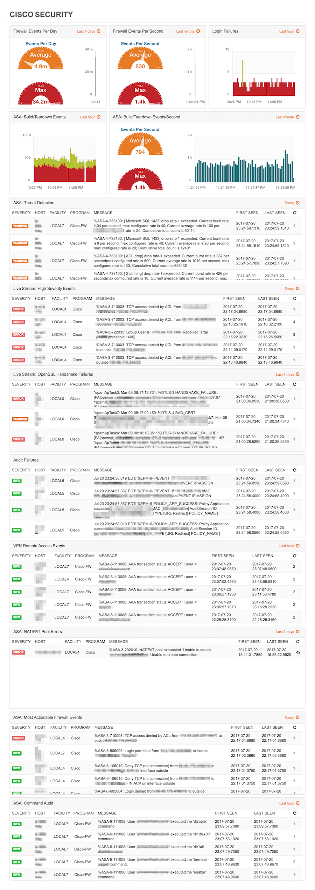

# LogZilla Dashboard For Cisco Systems

## Cisco Networks
This dashboard provides an overview for Cisco-based Network Events. Widgets included:

* Top 10 Cisco Devices with Failures
* Cisco Events Per Second
* Failed Events
* Errored Hosts
* Cisco Events Per Day
* Top Cisco Mnemonics
* Duplex Mismatch
* Device Power Events
* Subnet Mismatch
* Last 5 Cisco Mnemonics

## Cisco Most Actionable
This dashboard provides an overview for Cisco's `Most Actionable` network Events. Widgets included:

* Cisco: Spanning Tree BPDU
* Cisco: ASIC Module Error
* Cisco: OSPF Neighbor Change
* Cisco: Non IPSec-encapsulated Crypto
* Cisco: Crypto IKE Message Failure
* Cisco: ASIC Port Error
* Cisco: IPSec Error - Packet Missing from SADB
* Cisco: Crypto Packet Security Association Missing
* Cisco: Crypto Packet failed MAC verification
* Cisco: OSPF process received an invalid packet
* Cisco: Error disabled port has been reenabled
* Cisco: OSPF received LSA with wrong mask
* Cisco: HSRP VIP does not match the standby VIP
* Cisco: Unauthorized connection attempt on a secure port.
* Cisco: OSPF Hello Unidentified Sender
* Cisco: Interface disabled due to misconfiguration
* Cisco: Spanning Tree BPDU received from another bridge

## Cisco Firewalls
This dashboard provides an overview for Cisco-based Firewall Events. Widgets included:

* Firewall Events Per Day
* Firewall Events Per Second
* Login Failures
* Build/Teardown Events
* Build/Teardown Events Per Second
* [ASA Threat Detection](http://www.cisco.com/c/en/us/support/docs/security/asa-5500-x-series-next-generation-firewalls/113685-asa-threat-detection.html)
* Live Stream: High Severity Events
* Live Stream: OpenSSL Handshake Failures
* Audit Failures
* VPN Remote Access
* NAT/PAT Pool Errors
* Most Actionable Firewall Events
 - This widget contains over 70 "Most Actionable" Firewall Events.
* Command Audits

**Cisco Firewall Events Screenshot:**

## Cisco Identity Services Engine (ISE)

* ISE Passed Authentications Per Second
* ISE Authentication Top Hosts
* ISE Alarms
* ISE Failed Authentications

