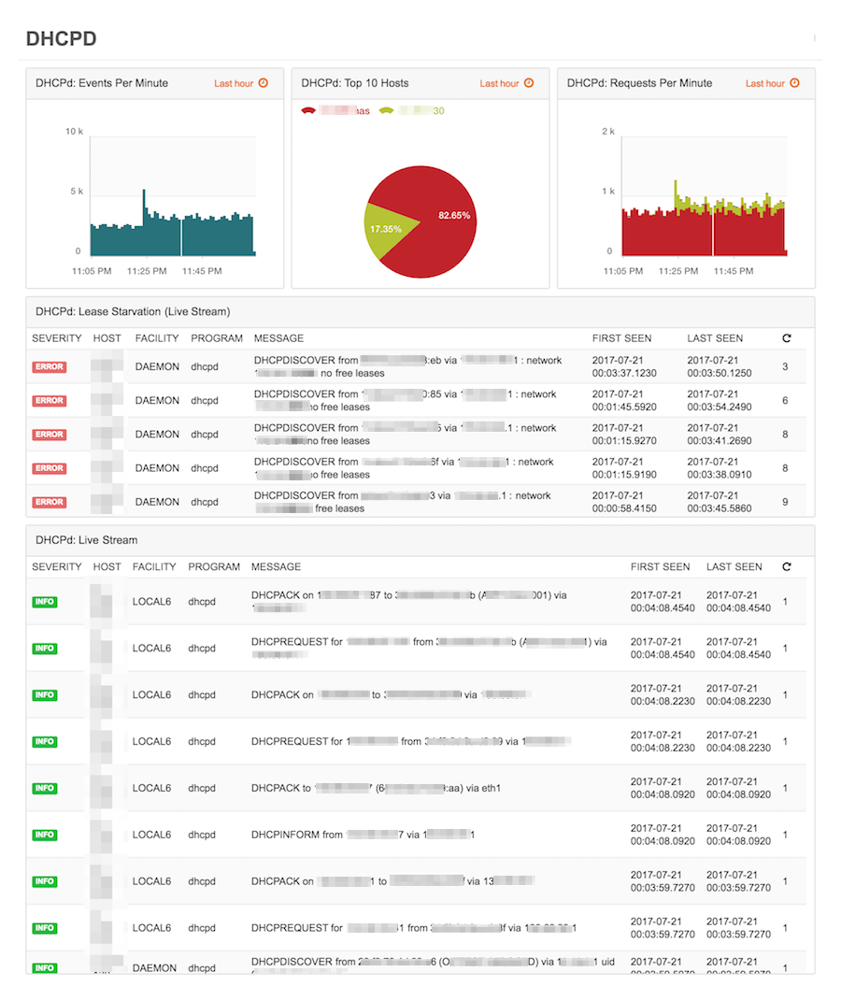

# LogZilla Dashboards For Linux Systems

## Dynamic Host Configuration
This dashboard provides an overview for DHCP-based Events. Widgets included:

* DHCPd Events Per Minute
* DHCPd: Top 10 Hosts
* DHCPd: Requests Per Minute
* DHCPd: Lease Starvation
* DHCPd: Live Stream

**DHCPd Dashboard:**

