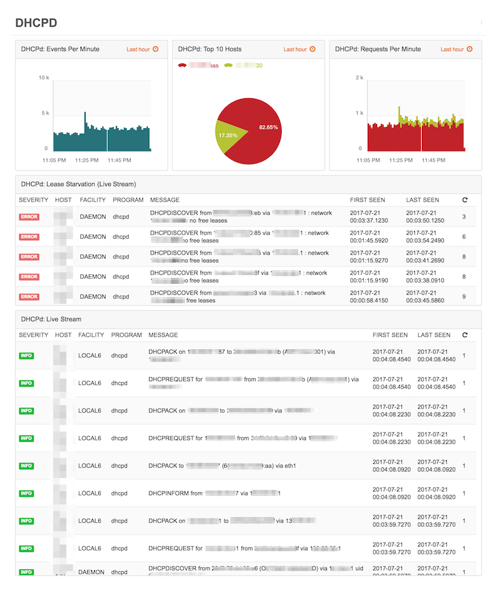
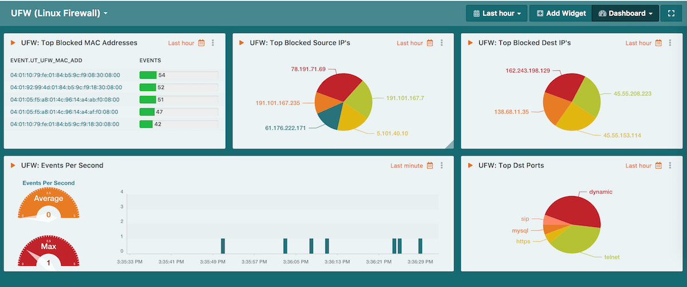

# LogZilla Dashboards For Linux Systems

## Dynamic Host Configuration
This dashboard provides an overview for DHCP-based Events. Widgets included:

* DHCPd Events Per Minute
* DHCPd: Top 10 Hosts
* DHCPd: Requests Per Minute
* DHCPd: Lease Starvation
* DHCPd: Live Stream

**DHCPd Dashboard:**

## UFW (Uncomplicated Firewall)
This dashboard provides user tag based widgets for Linux's UFW. Widgets included:
> Important: This dashboard requires the UFW rules included in the [Parsers directory](https://github.com/logzilla/extras/tree/master/parsers)

* UFW: Top Blocked Mac Addresses
* UFW: Top Blocked Source IP's
* UFW: Top Blocked Destination IP's
* UFW: Events Per Second
* UFW: Top Blocked Destination Ports

**UFW Dashboard:**

