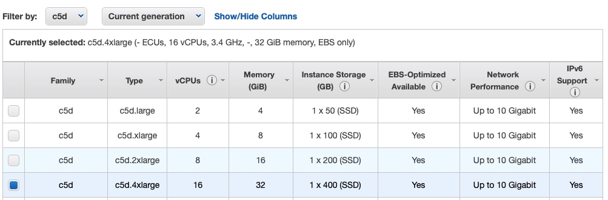
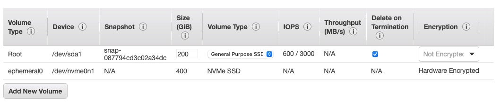

# LogZilla install on AWS

These commands require root access, to make things simple, use `sudo su -` to become root, rather than using `sudo command` for individual commands.


## Instance Details


The following instance type was used in tests, you may want to add mutiple data disks other than a single 400GB disk. If you use multiple disks, be sure to add all of them to the array in the formatting script below, e.g.: `disks=(/dev/foo /dev/bar /dev/baz)`


| Type        | OS                                                           | OS Disk            | Data Disk        |
| ----------- | ------------------------------------------------------------ | ------------------ | ---------------- |
| c5d.4xlarge | Ubuntu Server 20.04 LTS (HVM), SSD Volume Type, (64-bit x86) | Standard SSD 200GB | NVMe SSD (400GB) |


##### Instance Type



##### Volumes




## Update the OS

```
sudo apt update && \
sudo apt -y dist-upgrade && \
sudo apt -y autoremove && \
sudo update-grub
```


## Format the NVMe disk for use


WARNING: Change `/dev/nvme1n1` below to match your SECOND NVMe disk (make sure you don't use the OS disk)

If you used the recommended 200GB OS partition when creating the instance, the second disk name can be retrieved using:

```
fdisk -l | grep /dev/nv | grep -v 200
```

e.g.:

```
root@ip-10-0-0-147 [~]: # fdisk -l | grep /dev/nv | grep -v 200
Disk /dev/nvme1n1: 372.54 GiB, 400000000000 bytes, 781250000 sectors
root@ip-10-0-0-147 [~]: #
```


```
#!/bin/bash

# WARNING, THIS WILL ERASE DATA, make sure you don't set "disks" to your OS disk.
# You may use multiple disks separated by spaces, for example:
# disks=(/dev/foo /dev/bar /dev/baz)
# which would create a single logical volume based on 3 disks

disks=(/dev/nvme1n1)

mountpoint=/var/lib/docker
for disk in ${disks[*]}
do
  echo "Editing Disk $disk"
  parted --script -a optimal $disk \
    mklabel gpt \
    unit s \
    mkpart primary 2048s 100%\
    set 1 lvm
  parted $disk -s print
  pvcreate -M 2 --dataalignment 4k ${disk}
done
vgcreate logzilla ${disks[*]}
lvcreate -l 100%FREE logzilla

path=$(lvdisplay logzilla | grep Path | awk '{print $NF}')
echo "Creating ext4 filesystem on $path"
mkfs.ext4 $path

if [[ -d ${mountpoint} ]]; then
  [[ "$(ls -A ${mountpoint})" ]] && mv ${mountpoint} "${mountpoint}.orig"
else
  mkdir -p ${mountpoint}
fi
echo "Add the following line to your /etc/fstab"
echo "$path    $mountpoint    ext4    defaults    0 0"

```

Mount the new docker volume after adding it to `/etc/fstab`

```
mount /var/lib/docker
```


## Install Docker

```
curl -fsSL https://get.docker.com | sudo bash
```

## Install LogZilla

```
curl -fsSL https://logzilla.sh | sudo bash
```

LogZilla will install and start.
 
The default username and password for the LogZilla UI is `admin`/`admin`
