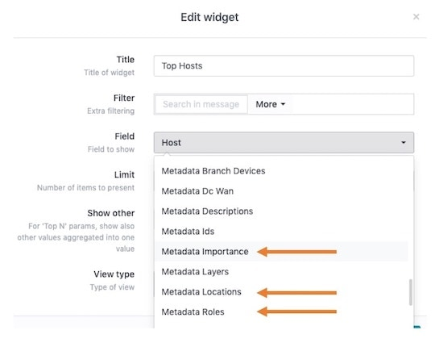

# Makemeta

This script will take in a tab separated file and convert the entries to a LogZilla rule in YAML or JSON format

## Input fields

The `.tsv` file must contain at least 6 columns

### Columns 1-4
Columns 1-4 must be:
	
```
addtag	matchString	matchField	matchOp
```
For example

```
1	10.1.2.3	host	eq
```

##### Column 1
Indicates whether or not (0 or 1) a user tag should also be created for this entry

##### Column 2
The string you want to match on, for example: `my.host.com` or `foo bar baz`

##### Column 3
The field to match on in LogZilla, such as `host`, `program`, `message`, etc.

##### Column 4

Defines the match Operator to use. Options are:


| Operator | Match Type        | Description                                                                                   |
|----------|-------------------|-----------------------------------------------------------------------------------------------|
| eq       | String or Integer | Matches entire incoming message against the string/integer specified in the `match` condition |
| ne       | String or Integer | Does *not* match anything in the incoming message `match` field.                              |
| gt       | Integer Only      | Given integer is greater than the incoming integer value                                      |
| lt       | Integer Only      | Given integer is less than the incoming integer value                                         |
| ge       | Integer Only      | Given integer is greater than or equal to the incoming integer value                          |
| le       | Integer Only      | Given integer is less than or equal to the incoming integer value                             |
| =~       | RegEx             | Match based on RegEx pattern                                                                  |
| !~       | RegEx             | Does *not* match based on RegEx pattern                                                       |
| =*       | RegEx             | RegEx appears anywhere in the incoming message                                                |


### Columns 5 and greater
All columns after column 4 are key value pairs to be added.
For example, given the following entire row in a file:

```
1	10.1.2.3	host	eq	deviceID	rtp-core-sw	DeviceDescription	RTP Core Layer2	DeviceImportance	High	DeviceLocation	Raleigh	DeviceContact	support@logzilla.net
```
Columns 5-14 will be separated into `key="value"` pairs, like so:

```
Key = DeviceImportance, value = High
Key = DeviceDescription, value = RTP Core Layer2
Key = DeviceLocation, value = Raleigh
Key = deviceID, value = rtp-core-sw
Key = DeviceContact, value = support@logzilla.net
```
Please make sure you have a value for every key. i.e., don't have something like:

```
1	10.1.2.3	host	eq	deviceID	rtp-core-sw	DeviceDescription	RTP Core Layer2	DeviceImportance	High	DeviceLocation	Raleigh	DeviceContact	
```
(missing support@logzilla.net at the end)

This would produce errors when the perl script runs, e.g.:

```
Odd number of elements in hash assignment at ./makemeta line 60, <$fh> line 4.
Use of uninitialized value $kvs{"DeviceContact"} in string comparison (cmp) at ./makemeta line 78, <$fh> line 4.
Use of uninitialized value $kvs{"DeviceContact"} in string comparison (cmp) at ./makemeta line 78, <$fh> line 4.
Use of uninitialized value $kvs{"DeviceContact"} in string comparison (cmp) at ./makemeta line 78, <$fh> line 4.
Use of uninitialized value $kvs{"DeviceContact"} in string eq at ./makemeta line 80, <$fh> line 4.
```


## Usage

```
./makemeta
    Usage:
    makemeta
    -debug [-d] <1 or 2>
    -format [-f] (json or yaml - default: yaml)
    -infile [-i] (Input filename, e.g.: test.tsv)
    Sample test.tsv file:
    1 <TAB> host-a <TAB> host <TAB> eq <TAB> deviceID <TAB> lax-srv-01 <TAB> DeviceDescription <TAB> LA Server 1
```

## User Tags
If column 1 on your `.tsv` contains a `1`, user tags will also be created for every key/value pair. As such, you will now see these fields available in your widgets. For example, the following rule:

```
 - match:
      - field: host
        op: eq
        value: host-a
    tag:
      ut_metadata_importance: High
      ut_metadata_roles: Core
      ut_metadata_locations: Los Angeles
    update:
      message: $MESSAGE DeviceDescription="LA Server 1" DeviceLocation="Los Angeles" DeviceImportance="Low" deviceID="lax-srv-01" DeviceContact="support@logzilla.net"
  - match:
      - field: message
        op: =~
        value: down
    update:
      message: $MESSAGE DeviceImportance="Med" DeviceDescription="NYC Router" DeviceLocation="New York" deviceID="nyc-rtr-01" DeviceContact="support@logzilla.net"
```


Will produce fields available similar to the screenshot below:
##### Screenshot: Available Fields



