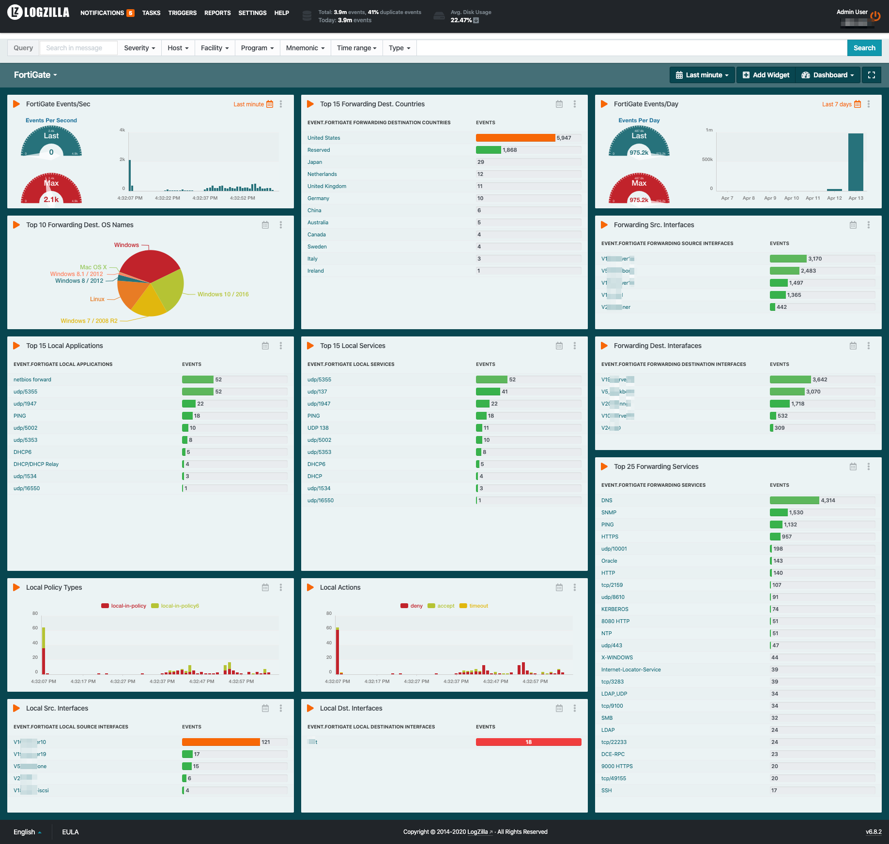

# FortiGate Dashboard


Be sure to load the associated rules for this dashboard located in ../../rules.d/untested/FortiGate/

[LINK](../../rules.d/untested/FortiGate/)

# Or do this from your LogZilla Server:

```
sudo su -
wget 'https://raw.githubusercontent.com/logzilla/extras/master/rules.d/untested/FortiGate/700-fortigate.yaml'
wget 'https://raw.githubusercontent.com/logzilla/extras/master/rules.d/untested/FortiGate/701-fortigate-normalize.yaml'
logzilla rules add 700-fortigate.yaml
logzilla rules add 701-fortigate-normalize.yaml
wget 'https://raw.githubusercontent.com/logzilla/extras/master/dashboards/FortiGate/dashboard-fortigate.yaml'
logzilla dashboards import -I dashboard-fortigate.yaml
```

##### Sample


