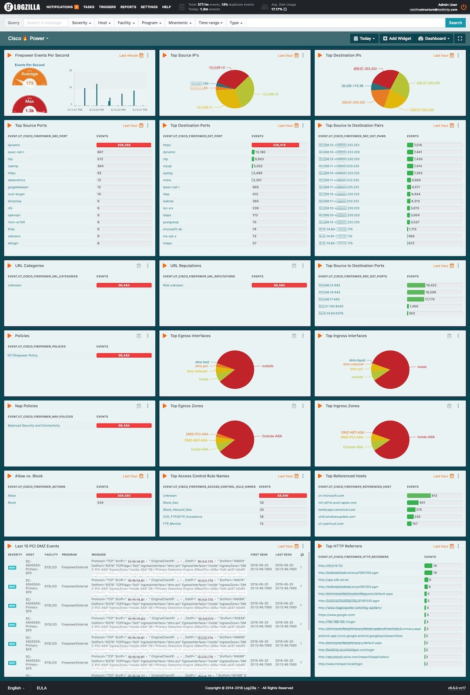

# Cisco Firepower Management Center

This package includes Dashboards, Rules, and Configs for Cisco's Firepower Management Center (FMC)

<font color="red">WARNING:</font> If your server is not properly sized, then you run the risk of causing problems. Please do not attempt to run these on a large network with something like a small/slow virtual machine.

You can test your server's capabilities by running `logzilla speedtest` or `logzilla rules performance`


# Sample Dashboards

##### Screenshot: Cisco FMC




# Integration

## Import rules

> As of LogZilla NEO v6.5, rules may be written in either YAML or JSON

From this directory, paste the following:

```
for rule in ls rules.d/*.yaml
do
  [ -f "${rule}" ] || continue
  sudo logzilla rules add ${rule} -f -R
done
sudo logzilla rules reload
```

## Import the dashboards

From this directory, paste the following:

```
for dashboard in dashboards/*.yaml
do
    [ -f "${dashboard}" ] || continue
    sudo logzilla dashboards import -I ${dashboard}
done
```

## Custom syslog-ng rule

> Note, if you already have any custom configs, you may need to merge the two - or at least make sure you only use a single `log{}` statement

```
vol=$(docker inspect --format '{{.Mountpoint}}' lz_config)
cp -i syslog-ng/*.conf $vol/syslog-ng/
docker restart lz_syslog

```

3. Refresh your browser in the LogZilla NEO UI

