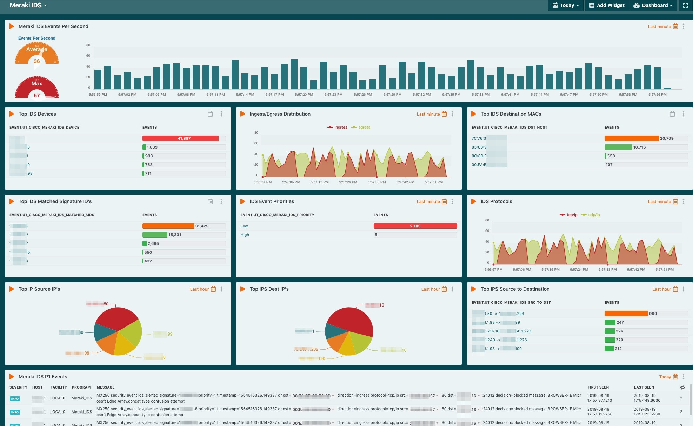
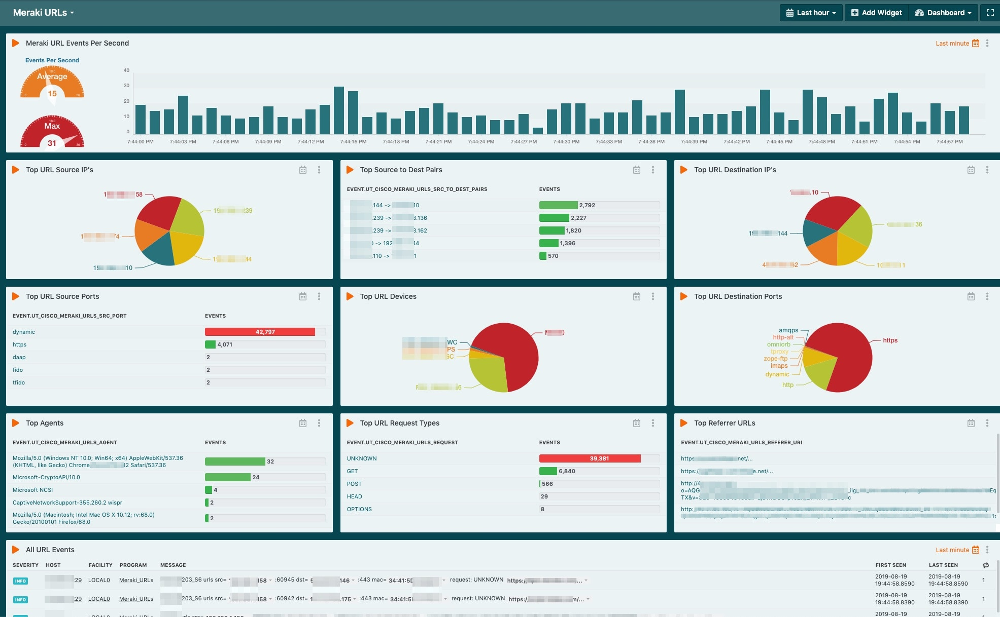
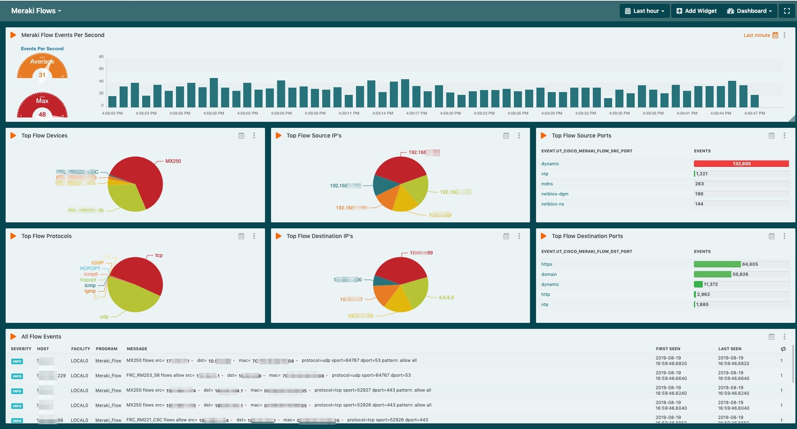
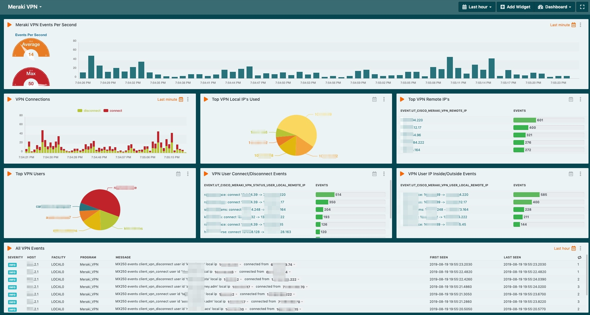
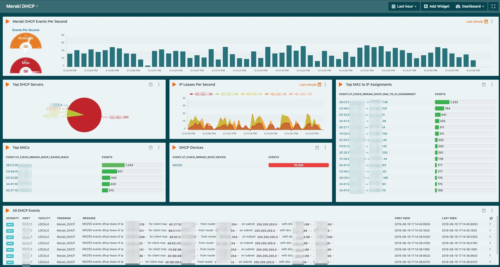
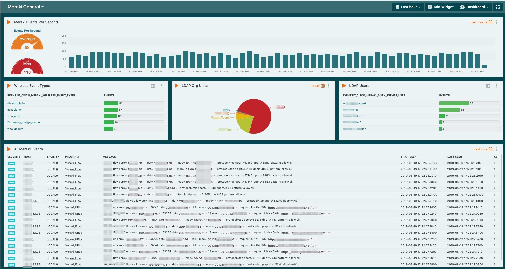

# Meraki

This package includes Dashboards, Rules, and Configs for Meraki Devices

Note that you must be using LogZilla NEO v6.6 or better for the rules to work

<font color="red">WARNING: There are a **lot** of rules here.</font> If your server is not properly sized, then you run the risk of causing problems. Please do not attempt to run these on a large network with something like a small/slow virtual machine.

You can test your server's capabilities by running `logzilla speedtest` or `logzilla rules performance`


# Sample Dashboards

##### Screenshot: Meraki IDS



##### Screenshot: Meraki URLs



##### Screenshot: Meraki Flows



##### Screenshot: Meraki VPN



##### Screenshot: Meraki DHCP



##### Screenshot: Meraki General



# Integration

1. Import rules:

> As of LogZilla NEO v6.5, rules may be written in either YAML or JSON

From this directory, paste the following (as the root user):

```
for rule in ls rules.d/*.yaml
do
  [ -f "${rule}" ] || continue
  logzilla rules add ${rule} -f -R
done

logzilla rules reload
```

2. Import the dashboards:

From this directory, paste the following (as the root user):

```
for dashboard in dashboards/*.yaml
do
    [ -f "${dashboard}" ] || continue
    logzilla dashboards import -I ${dashboard}
done
```

1. Copy the custom syslog-ng rule to the syslog volume:

> Note, if you already have any custom configs, you may want to merge the two - or at least make sure you only use a single `log{}` statement

```
cp -i syslog-ng/*.conf /var/lib/docker/volumes/lz_config/_data/syslog-ng/
docker restart lz_syslog

```

2. Add the following tags as High Cardinality:
```
tags=$(sudo logzilla config | grep CARD | awk -F'=' '{print $2}') && sudo logzilla config HIGH_CARDINALITY_TAGS "$tags Meraki Auth OU, Meraki Auth User, Meraki Content Filter Client MAC, Meraki Content Filter Port, Meraki Content Filter Server, Meraki Content Filter URL, Meraki Content Filter client_mac, Meraki Content Filter device, Meraki Content Filter port, Meraki Content Filter server, Meraki Content Filter user, Meraki DHCP Device, Meraki DHCP Leased IP, Meraki DHCP Leased MAC, Meraki DHCP MacIP Assignment, Meraki DHCP Server, Meraki Flow Device, Meraki Flow Dst IP, Meraki Flow Protocol, Meraki Flow Src IP, Meraki IDS DST Host, Meraki IDS Dst IP, Meraki IDS Matched SID, Meraki IDS Proto, Meraki IDS Src IP, Meraki IDS Src to Dst, Meraki URL Device, Meraki URL Request, Meraki URL Src IP, Meraki VPN Local IP, Meraki VPN Remote IP, Meraki VPN Status User Local IP to Remote, Meraki VPN User Local IP to Remote, Meraki VPN User"
```

3. Refresh your browser in the LogZilla NEO UI

