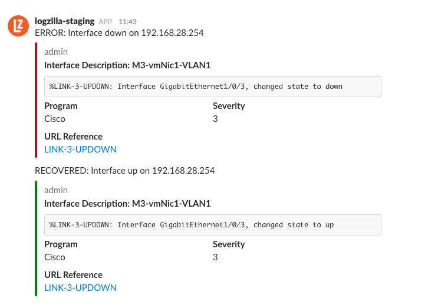

Cisco Interface Up/Down to Slack
---

This script will also connect to the device and get the affected Interface's description.


- Match on `LINK-3-UPDOWN`
- SSH to device and get the interface Description
- Reports results to Slack channel
  - Interface Down will come into slack as Red
  - Interface Up as green


# Log Sample
```
%LINK-3-UPDOWN: Interface GigabitEthernet1/0/10, changed state to down
```


# Script Type: Perl

```
#-----------------------------------------------------------------------------
# BEGIN: REQUIRED PACKAGES/MODULES
#-----------------------------------------------------------------------------

# Ubuntu:
# apt install libnet-ssh2-perl libcrypt-ssleay-perl cpanminus
#
# PERL:
# cpanm Net::SSH2::Cisco HTTP::Request::Common LWP::UserAgent JSON

#-----------------------------------------------------------------------------
# END: REQUIRED PACKAGES/MODULES
#-----------------------------------------------------------------------------
```

# Slack Webhook
You will need to obtain your webhook URL from the slack admin interface

Once you have that, modify the script and set the correct webhook url:

    my $posturl = https://hooks.slack.com/services/STRING/STRING/STRING';


# Results

Here's a screenshot of both Up and Down events


