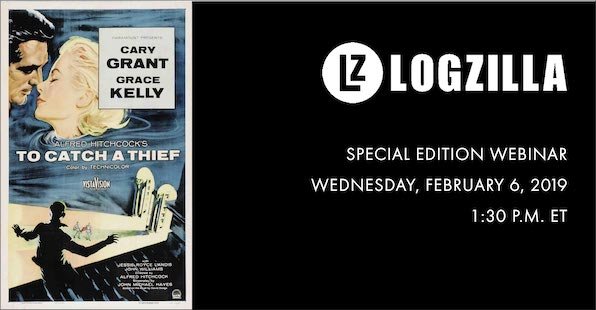

# To Catch A Thief

How a University Uses Cisco ISE and LogZilla NEO To physically Locate Mobile Device Thieves and alert police within seconds

All files for this Webinar are located in the [to-catch-a-thief](to-catch-a-thief) subdirectory.

# How to get the most out of your WatchGuard events

Learn how to extract and track 31 valuable event types such as Source/Dest IP pairs, Top Applications, Policies, Categories, NAT Ports, Geolocations, URLs, Denied Apps, and more

All files for this Webinar are located in the [watchguard](watchguard) subdirectory.

