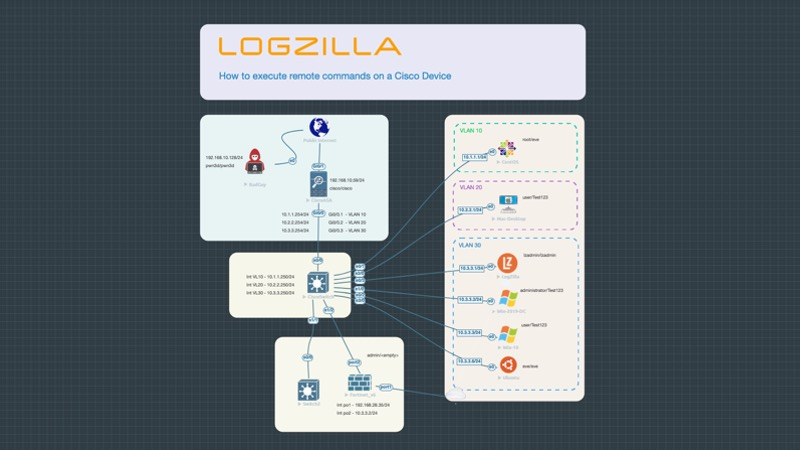

# Using LogZilla Triggers to execute remote commands on a Cisco Device


## Lab Setup





# LogZilla Trigger

1. Install docker-compose

```
sudo curl -L "https://github.com/docker/compose/releases/download/1.29.0/docker-compose-$(uname -s)-$(uname -m)" -o /usr/local/bin/docker-compose
sudo chmod +x /usr/local/bin/docker-compose
```

2. Create docker image for Perl

```
( cd docker && docker-compose up -d --build )
```


3. Add your script to the logzilla watcher container:

```
docker cp scripts/cisco-intUpDown-to-slack lz_watcher:/var/lib/logzilla/scripts/
```

4. Add the trigger to LogZilla

```
logzilla triggers import -I triggers/Howto_Remote_Cisco_Device_Commands.yaml
```

5. Get the trigger ID:

```
TID=$(logzilla triggers list | grep 'Remote Cisco Device Commands' | awk '{print $2}' | sed 's/,//g')
```

6. Get the docker image id:

(this assumes you kept the name `perl` from the docker-compose.yml file)

```
IMAGEID=$(docker image ls | grep perl | awk '{print $3}')
```

7. Attach the image to the trigger ID:

```
logzilla triggers update --trigger-id $TID --set script_docker_image=$IMAGEID
```


# Lab Testing Older Switches

Older Cisco Switches (or if using IoL in a lab) do not support the newer key exchange algorithms, you will need to add the following to your ~/.ssh/config in order to ssh to the switch:

```
echo 'Host 10.3.3.*
    KexAlgorithms +diffie-hellman-group1-sha1' >> ~/.ssh/config
```


# Lab Switch Configs
On each switch:


```
conf t
aaa new-model
aaa authentication login default local
username cisco password 0 cisco
line vty 0 4
 login authentication default
 privilege level 15
transport input ssh
ip domain-name logzilla.lab

crypto key generate rsa mod 2048
```

...wait for keys to generate, then:

```
ip ssh version 2
ip ssh time-out 60
ip ssh authentication-retries 2
```


