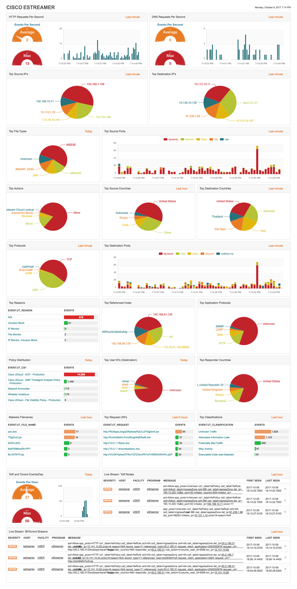
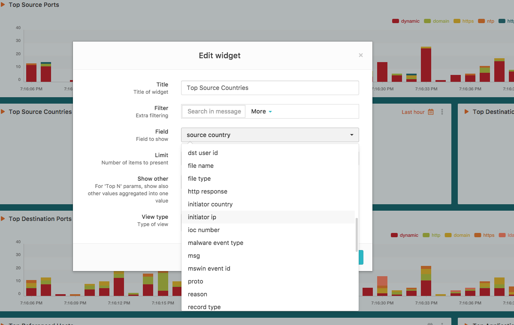

# Cisco FirePower FMC and LogZilla

## NOTE: This document was originally for LogZilla v5 and may not be exact for LogZilla NEO

# Notes
Use of this module requires UserTags to be enabled in LogZilla (which are enabled by default).

## Dashboard
We have included a sample dashboard (`dashboard-estreamer.json`) based on the user tags enabled with the default encore plugin (`logzilla.py`).

## LogZilla Rules
We've included some sample rules in the `rules.d/` directory for mapping ports to names (for example, `80=>http`) as well as rules for mapping Country codes sent in from eStreamer to Country Names.

## Scripts
We left a sample script located in the `scripts/` directory which was used to convert a list of Country Codes to a LogZilla rewrite rule. Users may find it useful for generating other large list conversions.


# Adapter Implementation

Edit your `estreamer.conf` and add `logzilla` to your `outputters`:

```
"outputters": [
            {
                "adapter": "logzilla",
                "enabled": true,
                "name": "LogZilla json format",
                "stream": {
                    "uri": "file:///var/log/logzilla/encore-lz.log"
                }
            }
        ],
        
```
      
## LogZilla will automatically create new tags for all fields sent in by encore. 

In the `logzilla.py` file, any of the `fields` that are left empty are ignored (no tag created).

Take the following snippet from `logzilla.py` for example:

```
MAPPING = {

    # 71
    definitions.RECORD_RNA_CONNECTION_STATISTICS: {
        'sig_id': lambda rec: 'RNA:1003:1',

        'name': lambda rec: 'CONNECTION STATISTICS',

        'severity': lambda rec: 3 if rec['ruleAction'] < 4 else 7,

        'constants': {
            'cs1Label': 'fwPolicy',
            'cs2Label': 'fwRule',
            'cs3Label': 'ingressZone',
            'cs4Label': 'egressZone',
        },

        'lambdas': {
            'src_ip': lambda rec: __ipv4( rec['initiatorIpAddress'] ),
            'dst_ip': lambda rec: __ipv4( rec['responderIpAddress'] ),
        },

        'fields': {
            'deviceId': '',
            'ingressZone': '',
            'egressZone': '',
            'initiatorIpAddress': 'initiator_ip',
            'responderIpAddress': 'responder_ip',
```

From that mapping, the following user tags will automatically be created in LogZilla:

* src_ip
* dst_ip
* initiatorIpAddress
* responderIpAddress

Whereas, the following 3 fields would simply be ignored:

* deviceId
* ingressZone
* egressZone

Should you find the need to track any of the fields left blank, you may do so by adding any text between the `''`. For example:

```
'ingressZone': 'ingress_zone',
```

All values ingested for that mapping would now show up in LogZilla under the `ingress_zone` tag.

## Encore Log to LogZilla

> It's highly unlikely that this works in LogZilla NEO.
> # TODO, create sample command here
As set in the `estreamer.conf` file, the last step is simply to `tail` the log file into LogZilla's `feeder` module.

```
tail -f /var/log/logzilla/encore-lz.log | logzilla feeder
```


# UI

## Import eStreamer Dashboard
To import the sample dashboard using the command line on your LogZilla server:

```
wget https://raw.githubusercontent.com/logzilla/extras/master/integrations/Cisco/FirePower-eStreamer/dashboard-estreamer.json

logzilla dashboards import -I dashboard-estreamer.json

```

**Sample Dashboard**




## Adding Widgets based on Tags

Next, edit any of the widgets on that dashboard (or add new ones using the "Add Widget" button) and select the new tags from the dropdown list:

**Auto-created Tags**



