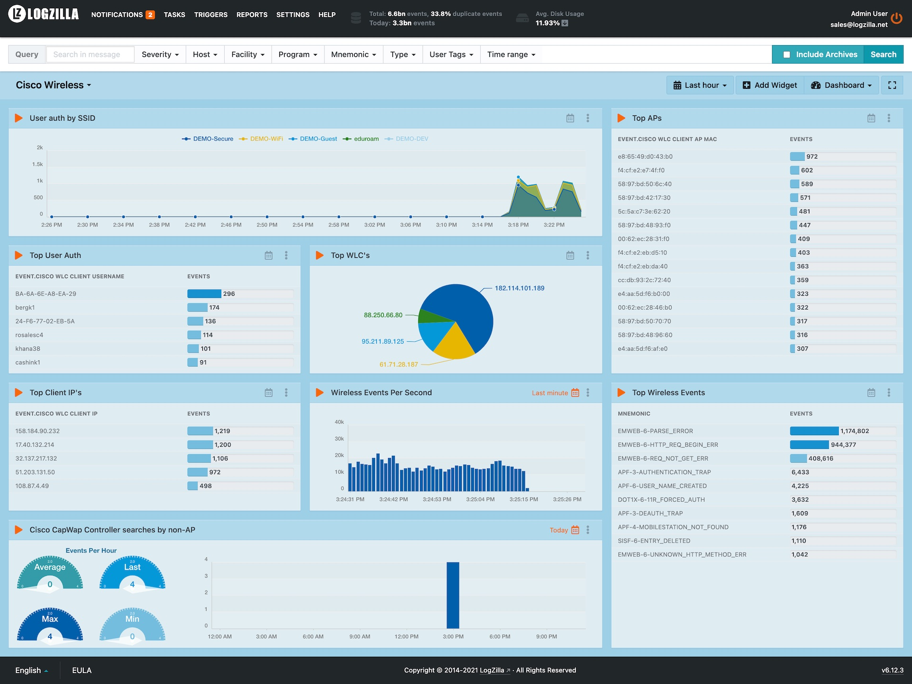

# Cisco Wireless Lan Controller

Reference: [Cisco Wireless Lan Controller Events](https://www.cisco.com/c/en/us/support/wireless/wireless-lan-controller-software/products-system-message-guides-list.html)

# Installation

```
wget 'https://raw.githubusercontent.com/logzilla/extras/master/packages/Cisco/Wireless/003-cisco-wireless.yaml'
sudo logzilla rules add 003-cisco-wireless.yaml -f'

wget 'https://raw.githubusercontent.com/logzilla/extras/master/packages/Cisco/Wireless/dashboard-cisco-wireless.yaml'
sudo logzilla dashboards import -I dashboard-cisco-wireless.yaml
```

###### Customers running LogZilla `v6.12` or lower must also run the following commands:

```
# check to make sure you don't already have defined tags, if so, add them along with the new ones:
logziilla config | grep HIGH_CARDINALITY_TAGS
```
```
logzilla config HIGH_CARDINALITY_TAGS "Cisco WLC Client AP MAC, Cisco WLC Client IP, Cisco WLC Client MAC, Cisco WLC Client Username"
```
```
logzilla restart
```

# Sample Dashboard


