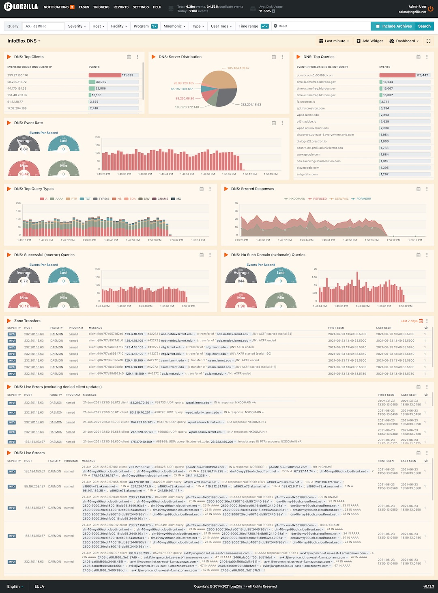

# InfoBlox DNS


# Installation

```
wget 'https://raw.githubusercontent.com/logzilla/extras/master/packages/InfoBlox/rules.d/500-infoblox-dns-query-logging.yaml'
sudo logzilla rules add 500-infoblox-dns-query-logging.yaml -f

wget 'https://raw.githubusercontent.com/logzilla/extras/master/packages/InfoBlox/dashboards/dashboard-infoblox-dns.yaml'
sudo logzilla dashboards import -I dashboard-infoblox-dns.yaml
```

###### Customers running LogZilla `v6.12` or lower must also run the following commands:

```
# check to make sure you don't already have defined tags, if so, add them along with the new ones:
logziilla config | grep HIGH_CARDINALITY_TAGS
```
```
logzilla config HIGH_CARDINALITY_TAGS "Infoblox DNS Client IP, Infoblox DNS Client Query"
```
```
logzilla restart
```

# Sample Dashboard


