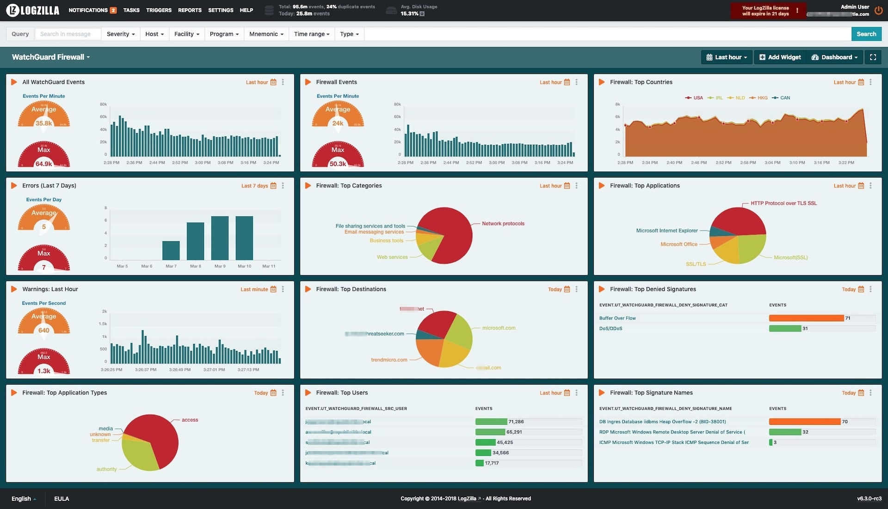
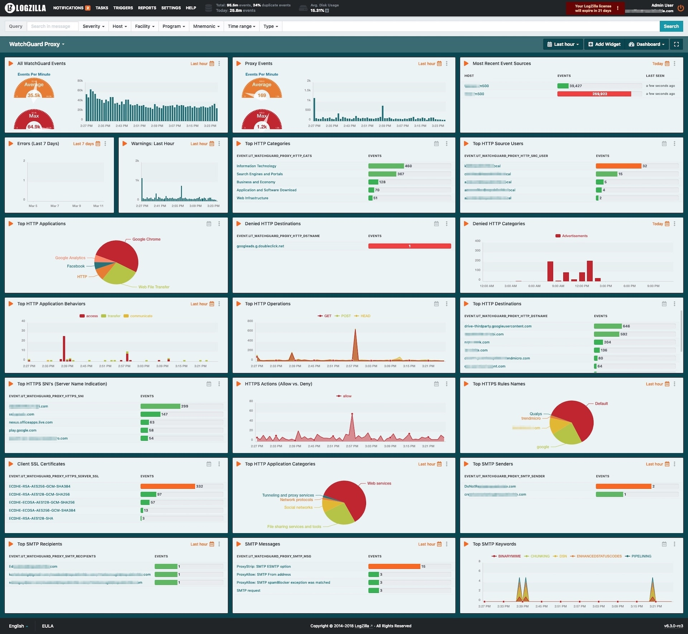

# WatchGuard Rules

These rules were tested on LogZilla NEO v6.3 but should work for future versions.


## Adding Rules

To load the rules, paste the following as either root or a user with docker permissions:

```
for f in rules.d/*.yaml
do
    logzilla rules add "$f" -f -R
done
logzilla rules reload
```

## Importing the Dashboard

To import the dashboard, paste the following command:

```
for f in dashboards/*.json
do
  logzilla dashboards import -I $f
done
```

## Sample Dashboard - Watchguard Firewall




## Sample Dashboard - Watchguard Proxy


