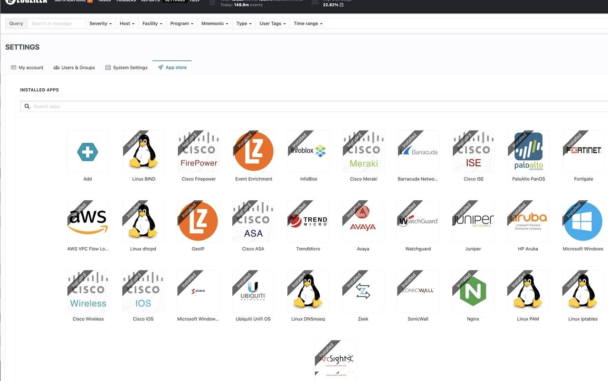

# LogZilla App Transition

The traditional LogZilla Rules stored in this repository are now outdated. We've transitioned all our rules into the more efficient LogZilla Apps. These apps can be seamlessly activated directly within the LogZilla platform. For comprehensive guidance, navigate to *Settings->App Atore* in the LogZilla UI or refer to our official documentation at [https://docs.logzilla.net](https://docs.logzilla.net).

 

