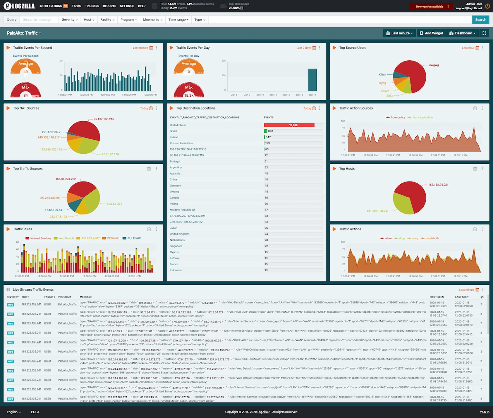

<!-- @@@title:PaloAlto PanOS Configuration@@@ -->

# PaloAlto

## Prerequisites
The PAN-OS sources must be configured properly in order for these rules to work.

* Configure the device to include its IP address in the header of Syslog messages, select `Panorama/Device > Setup > Management`, click the Edit icon in the `Logging and Reporting Settings` section and navigate to the `Log Export and Reporting` tab. In the `Syslog HOSTNAME Format` drop-down select `ipv4-address`, then click `OK`.

* Select `Server Profiles > Syslog` click `Add`

* Enter a server profile `Name and Location` (location refers to a virtual system, if the device is enabled for virtual systems).

* In the `Servers` tab, click `Add` and enter a Name, IP address (`Syslog Server` field), `Transport`, `Port` (default 514 for UDP), and `Facility` (default LOG_USER) for the Syslog server.

* Select the `Custom Log Format` tab and select `Threat`, then paste the following values in the Custom Log Format area:

```
PaloAlto_Threat type="$type" src="$src" dst="$dst" rule="$rule" srcuser="$srcuser" sessionid="$sessionid" action="$action" misc="$misc" dstloc="$dstloc" referer="$referer" http_method="$http_method" http_headers="$http_headers"
```

* Select the `Custom Log Format` tab and select `Threat`, then paste the following values in the Custom Log Format area:

```
PaloAlto_Threat type="$type" src="$src" dst="$dst" rule="$rule" srcuser="$srcuser" sessionid="$sessionid" action="$action" misc="$misc" dstloc="$dstloc" referer="$referer" http_method="$http_method" http_headers="$http_headers"
```

* Select the `Custom Log Format` tab and select `Traffic`, then paste the following values in the Custom Log Format area:

```
PaloAlto_Traffic type="$type" src="$src" dst="$dst" natsrc="$natsrc" natdst="$natdst" rule="$rule" srcuser="$srcuser" from="$from" to="$to" sessionid="$sessionid" sport="$sport" dport="$dport" natsport="$natsport" natdport="$natdport" proto="$proto" action="$action" bytes="$bytes" packets="$packets" dstloc="$dstloc" action_source="$action_source"
```

* Save and commit your changes.


## LogZilla Rules and Dashboards

* Save the following as `700-paloalto-threat.yaml`:

```
pre_match:
  - field: message
    op: =*
    value: THREAT
rewrite_rules:
- comment: 'Palo_Alto: PaloAlto Threat Events'
  match:
  - field: program
    op: eq
    value: PaloAlto_Threat
  tag:
    ut_paloalto_types: "${type}"
    ut_paloalto_threat_sources: "${src}"
    ut_paloalto_threat_destination_locations: "${dstloc}"
    ut_paloalto_threat_rules: "${rule}"
    ut_paloalto_threat_actions: "${action}"
- comment: 'Palo_Alto: Remove \ from usernames'
  match:
  - field: message
    op: =~
    value: 'srcuser="\S+\\(\S+)"'
  tag:
    ut_paloalto_threat_source_users: "$1"

```

* Save the following as `700-paloalto-traffic.yaml`:

```
pre_match:
  - field: message
    op: =*
    value: TRAFFIC
rewrite_rules:
- comment: 'Palo_Alto: PaloAlto Traffic Events'
  match:
  - field: program
    op: eq
    value: PaloAlto_Traffic
  tag:
    ut_paloalto_types: "${type}"
    ut_paloalto_traffic_sources: "${src}"
    ut_paloalto_traffic_destination_locations: "${dstloc}"
    ut_paloalto_traffic_nat_sources: "${natsrc}"
    ut_paloalto_traffic_rules: "${rule}"
    ut_paloalto_traffic_actions: "${action}"
    ut_paloalto_traffic_action_sources: "${action_source}"
- comment: 'Palo_Alto: Remove \ from usernames'
  match:
  - field: message
    op: =~
    value: 'srcuser="\S+\\(\S+)"'
  tag:
    ut_paloalto_traffic_source_users: "$1"
```

* Load each of the logzilla paloalto rules using the `logzilla rules add` command:

```
logzilla rules add 700-paloalto-threat.yaml
logzilla rules add 700-paloalto-traffic.yaml

```

* Import the dashboards:

Download the PA dashboards from our [GitHub Repository](https://github.com/logzilla/extras/tree/master/packages/PaloAlto/dashboards) and load them either from the UI (Select any Dashboard, then click `Dashboard>Import` from file at the top left of that dashboard). Or use the command line: 


```
wget -O palo-alto-threat.dashboard.json 'https://raw.githubusercontent.com/logzilla/extras/master/packages/PaloAlto/dashboards/palo-alto-threat.dashboard.json'
logzilla dashboards import -I palo-alto-threat.dashboard.json
wget -O palo-alto-traffic.dashboard.json 'https://raw.githubusercontent.com/logzilla/extras/master/packages/PaloAlto/dashboards/palo-alto-traffic.dashboard.json'
logzilla dashboards import -I palo-alto-traffic.dashboard.json
```

Your dashboards will look similar to this:

##### Threat Dashboard


##### Traffic Dashboard



