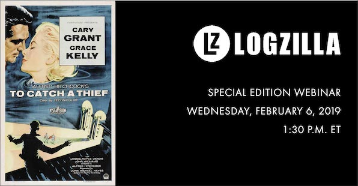
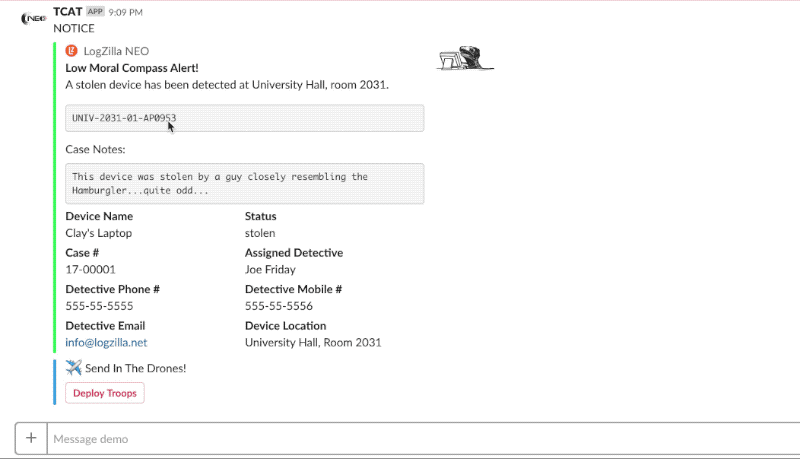

- [Product and Tools Used](#Products%20and%20Tools%20Used)
  * [Cisco ISE](#Cisco%20ISE)
  * [Cisco WLC](#Cisco%20WLC)
  * [Perl](#Perl)
  * [NGrok](#Ngrok)
  * [NodeJS](#NodeJS)
  * [Slack](#Slack)

<!-- toc -->

How a University uses Cisco ISE and LogZilla NEO (Network Event Orchestrator&trade;) to physically locate mobile device thieves and alert police within seconds.

## Product and Tools Used

### Cisco ISE

Cisco ISE events were sent to LogZilla's NEO (Network Event Orchestrator&trade;) and used to extract the Wireless lan controller's IP address along with the CapWap ID.

### Cisco WLC

We opted to connect directly to the wireless lan controllers to pull the AP names due to latency issues with Cisco Prime.

### Perl

[Perl was used](neo/scripts) to connect to the Cisco WLC (wireless lan controller) to obtain the AP name using CapWap ID from the incoming Cisco ISE logs.

We also used the same perl script to post to a slack channel along with a callback button, allowing the NOC team to indicate whether or not they wanted to alert police.

### ngrok

We used [ngrok](https://ngrok.com/) as a way to [provide access to callback](slack/ngrok) functions from Slack to our internal server located behind a firewall.

### NEOBot (NodeJS middleware)

[NodeJS was used as middleware](slack/neobot) so that the `Deploy Troops` button in slack had a way to push a callback function back into LogZilla NEO's API from the outside world.

### Slack

[Slack was used](https://api.slack.com/apps/AFXUF8XJQ/interactive-messages) to allow the NOC team to trigger the alert to the detective assigned to the case.

