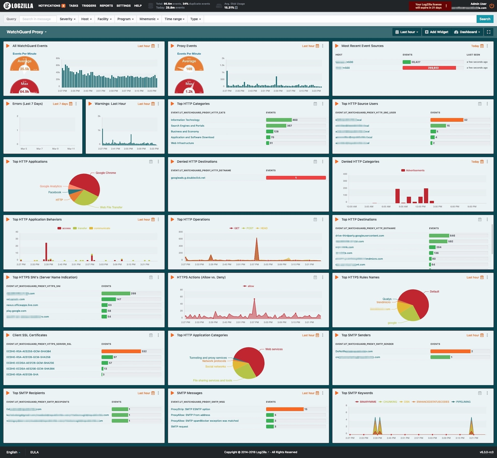

# WatchGuard Rules

These rules were tested on LogZilla NEO v6.3 but should work for future versions.


## Adding Rules

To load the rules, paste the following as either root or a user with docker permissions:

```
cd rules.d/
for f in *.json
do
    logzilla rules add "$f"
done
```

## Importing the Dashboard

To import the dashboard, paste the following command:

```
cd dashboards
logzilla dashboards import -I watchguard.dashboard.json
```

## Sample Dashboard - Watchguard Firewall


## Sample Dashboard - Watchguard Proxy


