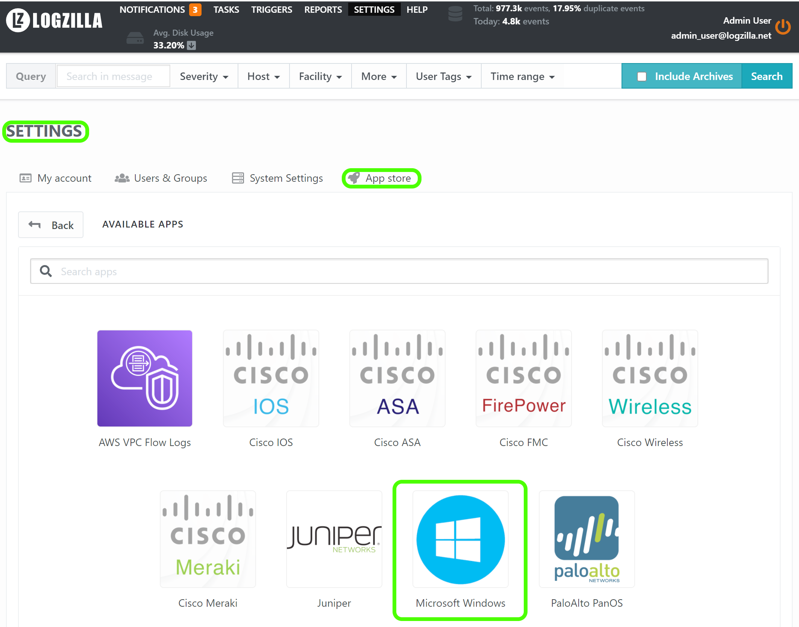

# Introduction

LogZilla NEO Windows Eventlog Agent

The NEO Windows Syslog Agent is a Windows service that sends Windows event log
messages to a LogZilla server.  For a Windows environment it takes the place
of a unix syslog service.

[Download](LogZilla_SyslogAgent_6.22.0.0.msi) Here

Features
This program supports the following:
* Simple configuration and ease of use.
* Select of specific event logs
* Configuration of primary and secondary LogZilla recipient servers
* Configuration of optional TLS transport for log messages
* Optional ignoring specified Windows event IDs
* Optional "tail"-ing of specified file

# History

Parts of this Syslog Agent are based the Datagram Syslog Agent, which in turn
was based on SaberNet's NTSyslog. 

The LogZilla development team has added specific support to the agent for
LogZilla via TCP and JSON, as well as fixing bugs and many other features
and enhancements.

# Prerequisites

The Syslog Agent Configuration, `SyslogAgentConfig.exe`, requires .NET
Framework 4.6.2 or later. The Syslog Agent service itself, `SyslogAgent.exe`,
has no prerequisites.

# Installation and Configuration

1. If installing over a previous version of the Syslog Agent it is recommended
to shut down the Syslog Agent Windows service before proceeding, but then upon
install it should take the place of the old agent automatically.
2. Run the MSI installer file downloaded from GitHub.
3. The MSI installer creates the path and subfolder and places the system
files needed in that folder.
4. The folder and path containing the needed files will be located at
`C:\Program Files\LogZilla\SyslogAgent\` .
5. Run the program from the newly created shortcut on the desktop and set the
options as pictured below (changing the server address to yours) and then
click the **save** and **restart** button at the bottom.
6. If you had not already done so, within the LogZilla web ui using the
LogZilla app store you must install the MS Windows app.

##### Screenshot: Agent Configuration

# Configuration

The operation of the Syslog Agent service is controlled by registry settings.
These can be maintained with the Syslog Agent configuration program,
`SyslogAgentConfig.exe`. This program must be run as administrator.

### Permissions
Although the installer will automatically attempt to set the option, some
Windows systems may require you to Right-click and "Run as administrator"
(depending on the security settings in place on the system/OS version being
used).

You may also change the advanced settings of the executable to always
"run asadministrator" by selecting the `syslogagentconfig.exe` file, then
right click and choose `advanced` and tick the box labeled 
`always run as administrator`

## Servers
The address and port for the primary Syslog server, and optionally for a
secondary server can be entered.  The address can be either a host name or an
IP address.

## Secondary LogZilla Server
There is an option to send messages to a secondary Syslog server.  If selected,
every message successfully sent to the primary server will also be sent to the
secondary server.

## Primary / Secondary Use TLS
There is an option to use TLS to send messages to one or both LogZilla servers.
If selected, every message sent to the primary or secondary server will use a
TLS communications link.

## Select Primary / Secondary Cert
These buttons are used to select (PEM format) certificate files for the 
communications to the primary or secondary server.  When the button is clicked
a window will pop up allowing selection of the file from which the cert is to
be read.  Please note that once the cert is read and imported (using the
button) that certificate information is copied into the LogZilla settings and
the source cert file is no longer used.  If desired the cert information that
LogZilla uses can be directly edited in the files `primary.cert` and
`secondary.cert` in the LogZilla directory.

## Event Logs
A list of all event logs on the local system is displayed.  Messages in the
event logs that are checked will be sent to the server.

## Poll Interval
This is the number of seconds between each time the event logs are read to
check for new messages to send.

## Look up Account IDs
Looking up the domain and user name of the account that generated a message
can be expensive, as it may involve a call to a domain server, if the account
is not local.  To improve performance, this look up can be disabled and
messages will be sent to the server without any account information.

## Ignore Event Ids
To reduce the volume of messages sent, it is possible to ignore certain event
ids.  This is entered as a comma-separated list of event id numbers.

## Facility
The selected facility is included in all messages sent.

## Severity
By selecting ‘Dynamic’, the severity for each message is determined from the
Windows event log type.  Otherwise, the selected severity is included in all
messages sent.

## Extra Key-Value Pairs
This configures whether any supplemental key-value pairs will be included with the log messages, for
processing by LogZilla rules. Key-value pairs should be separated by commas.
In addition to the manually specified key-values, LogZilla includes some default key-value pairs for use in
the LogZilla rules:
* “EventID” : “nnnn” contains the Windows event id
* “EventLog”: ”xxx” ... contains the name of the event log that produced the message
* “_source_type” : “WindowsAgent” identifies this program as the sender of the message
LogZilla Windows Syslog Agent V6.22.0.0 4
* “_log_type”: ”eventlog” OR “_log_type”: ”file” ... indicates whether the log message originated
in a Windows event log or originated from the “tail” operation

## Debug Log Level
This configures the “level” of log messages produced by the Syslog Agent.  The
“level” means the type or importance of a given message.  Any given log level
will produce messages at that level and those levels that are more important.
For example if “RECOVERABLE” is chosen, the Syslog Agent will also produce log
messages of levels “FATAL” and “CRITICAL”.  Logging is optional, so this can
be left set to “None”.  

## Log File Name
This configures the path and name of the file to which log messages will be
saved. If a path and directory are specified that specific combination will be
used for the log file, otherwise the log file will be saved in the directory
with the SyslogAgent.exe file.

## File Watcher (tail)
The agent has the capability to “tail” a specified text file – this means that
the agent will continually read the end of the given text file and send each
new line that is appended to that text file as a separate message to the
LogZilla server.  A program name should be specified here to indicate the
source of those log messages. 

## LogZilla Configuration 
In order for LogZilla to make use of the Windows Syslog Agent the LogZilla
rule for the agent must be installed.  The preferred means of accomplishing
this is by installing the MS Windows app from the LogZilla appstore, by going
to `Settings` -> `App store` then choosing Microsoft Windows and then choosing
`Install`.

After the app is installed LogZilla will be set to properly handle event and
file log messages coming from the Windows Syslog Agent.  

## Further Help
The installation process will place a file
[LogZillaSyslogAgentManual.pdf](LogZillaSyslogAgentManual.pdf) in the
installation directory (`C:\Program Files\LogZilla\SyslogAgent\`).  That file
is also available for direct download at the link above.
