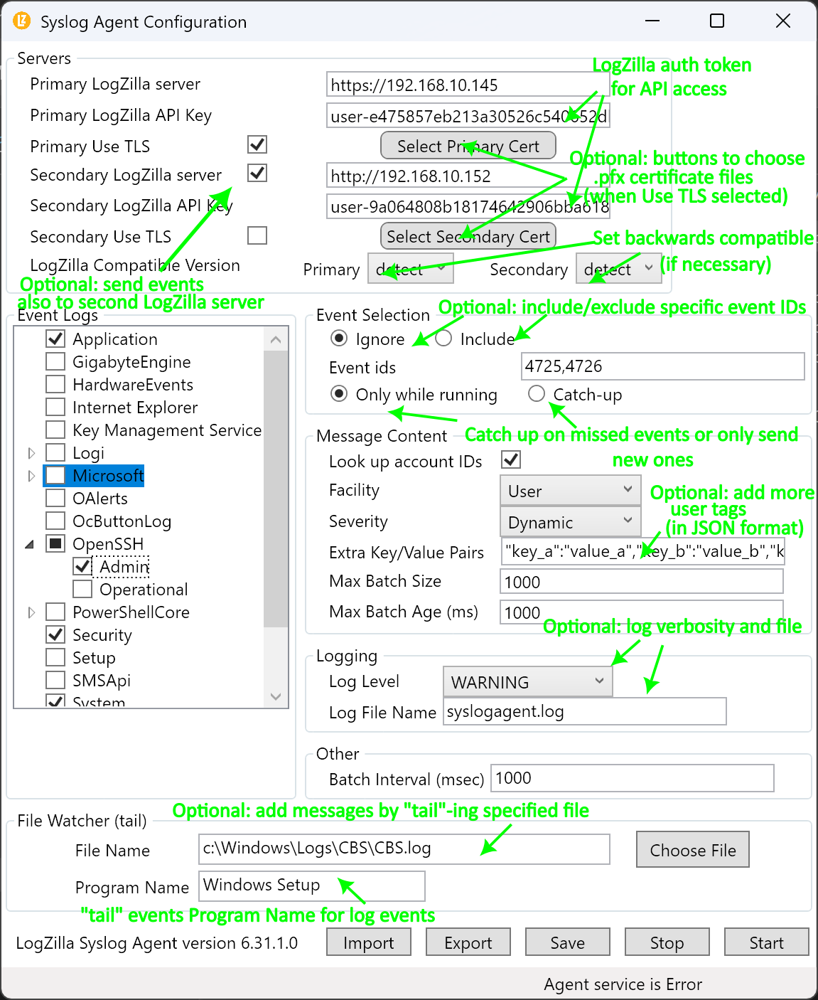

# Introduction

LogZilla NEO Windows Eventlog to Syslog


The NEO syslog agent is a Windows service that sends Windows event log messages to a syslog server.  Syslog is a widely used protocol of event notification and Syslog Agent allows Windows machines to be part of this environment.

[Download](LogZilla_SyslogAgent_2.0.4.msi) Here


# Features

This program supports the following:

- Simple configuration and ease of use.
- UDP and TCP transport on IPV4 and IPV6.
- Syslog protocols RFC3164 and RFC5424.

# History

Parts of this Syslog Agent are based the Datagram Syslog Agent, which in turn was based on SaberNet's NTSyslog. 

The original agents did not support RFC5424 or TCP. We've had our development team fix the bugs and add support for these protocols and standards as well as many other features and enhancements.

# Prerequisites

The Syslog Agent Configuration, `SyslogAgentConfig.exe`, requires .NET Framework 4.6.2 or later. The Syslog Agent service itself, `SyslogAgent.exe`, has no prerequisites.

# Install and configuration

1. If any previous versions exist - uninstall them and delete the folder that the files were previously housed in.
2. Run the MSI installer pkg downloaded from GitHub
3. The MSI installer creates the path and subfolder and places the system files needed in that folder.
4. The folder and path containing the needed files will be located at `C:\Program Files\LogZilla\SyslogAgent\`
5. Run the program from the newly created shortcut on the desktop and set the options as pictured below (changing the server address to yours) and then click the **save** and **restart** button at the bottom
6. Load the rule files for categorizing Microsoft events:

```
wget https://raw.githubusercontent.com/logzilla/extras/master/rules.d/Microsoft/599-LZ-Winagent.yaml
wget https://raw.githubusercontent.com/logzilla/extras/master/rules.d/Microsoft/600-Microsoft-ATP-Gateway.yaml
wget https://raw.githubusercontent.com/logzilla/extras/master/rules.d/Microsoft/601-lz-mswin-program.yaml
wget https://raw.githubusercontent.com/logzilla/extras/master/rules.d/Microsoft/602-Microsoft-Events.yaml
wget https://raw.githubusercontent.com/logzilla/extras/master/rules.d/Microsoft/603-Microsoft-Event-Crits.yaml
wget https://raw.githubusercontent.com/logzilla/extras/master/rules.d/Microsoft/604-Microsoft-Compliance.yaml
wget https://raw.githubusercontent.com/logzilla/extras/master/rules.d/Microsoft/605-Microsoft-Categories.yaml
wget https://raw.githubusercontent.com/logzilla/extras/master/rules.d/Microsoft/606-Microsoft-User-Tracking.yaml
sudo logzilla rules add 599-LZ-Winagent.yaml -f -R
sudo logzilla rules add 601-lz-mswin-program.yaml -f -R
sudo logzilla rules add 602-Microsoft-Events.yaml -f -R
sudo logzilla rules add 603-Microsoft-Event-Crits.yaml -f -R
sudo logzilla rules add 604-Microsoft-Compliance.yaml -f -R
sudo logzilla rules add 605-Microsoft-Categories.yaml -f -R
sudo logzilla rules add 606-Microsoft-User-Tracking.yaml -f
```


##### Screenshot: Agent Configuration



# Configuration

The operation of the Syslog Agent service is controlled by registry settings.  These can be maintained with the Syslog Agent configuration program, `SyslogAgentConfig.exe`. This program must be run as administrator.

### Permissions
Although the installer will automatically attempt to set the option, some windows systems may require you to Right-click and "Run as administrator" (depending on the security settings in place on the system/OS version being used).

You may also change the advanced settings of the executable to always "run as administrator" by selecting the `syslogagentconfig.exe` file, then right click and choose `advanced` and tick the box labeled `always run as administrator`

## Protocols
Messages can be delivered to the Syslog server with the UDP protocol or the TCP protocol.
If the UDP protocol is chosen, there is an option to ping the Syslog server before sending messages (UDP after ping).  Since UDP is a connectionless protocol, the ping can provide some assurance that the server is actually receiving messages.
If the TCP protocol is chosen, messages are delivered using octet counting.
The message format can be either RFC3164 or RFC5424

## Servers
The address and port for the primary Syslog server, and optionally for a secondary server can be entered.  The address can be either a host name or an IP address.

## Send to secondary
There is an option to send messages to a secondary Syslog server.  If selected, every message successfully sent to the primary server will also be sent to the secondary server.

## Event Logs
A list of all event logs on the local system is displayed.  Messages in the event logs that are checked will be sent to the server.

## Poll Interval
This is the number of seconds between each time the event logs are read to check for new messages to send.

## Ignore Event Ids
To reduce the volume of messages sent, it is possible to ignore certain event ids.  This is entered as a comma-separated list of event id numbers.

## Look up Account IDs
Looking up the domain and user name of the account that generated a message can be expensive, as it may involve a call to a domain server, if the account is not local.  To improve performance, this look up can be disabled and messages will be sent to the server without any account information.

## Include key-value pairs
To aid parsing on the syslog server, the message content is enhanced by appending the following key-value pairs:
    • EventID=”nnn” contains the Windows event id
    • Source=”LZ_SyslogAgent” identifies this program as the sender of the message
    • S1=”xxx”, S2=”xxx”, … contain the substitution strings, if any

## Use JSON Message
The syslog messages arising from the event log can optionally be formatted as JSON rather than comma-separated.  This format is easier to process by LogZilla and can result in higher event-per-second rates.

## Facility
The selected facility is included in all messages sent.

## Severity
By selecting ‘Dynamic’, the severity for each message is determined from the Windows event log type.  Otherwise, the selected severity is included in all messages sent.

## Suffix
The suffix is an optional string that is appended to all messages sent.

## Forwarder
The syslog agent for Windows can be used to forward syslog traffic from other originating systems to the specified destination (LogZilla) server.  To use this capacity, check the “Use Forwarder” box, then specify the ports on which to listen for incoming syslog traffic.  All traffic coming into those ports will be forwarded to the primary (and secondary) servers specified above.

## Character substitution
Some log viewers may have problems with control characters in log message, so it is possible to replace carriage returns, line feeds and tabs with some other character, by entering the ASCII value of its replacement.  For example, we can replace carriage returns with blanks by entering the ASCII code for blank: 32.  To remove a control character, enter a zero value.  To leave a control character unchanged, enter its ASCII value: e.g., 13, 10 or 9.

## Log Level
This configures the “level” of log messages produced by the Syslog Agent.  The “level” means the type or importance of a given message.  Any given log level will produce messages at that level and those levels that are more important.  For example if “RECOVERABLE” is chosen, the Syslog Agent will also produce log messages of levels “FATAL” and “CRITICAL”.  Logging is optional, so this can be left set to “None”.  

## Log File Name
This configures the path and name of the file to which log messages will be saved.   If a path and directory are specified that specific combination will be used for the log file, otherwise the log file will be saved in the directory with the SyslogAgent.exe file.  If log level is set to “None” this setting is ignored.  If log level is specified and this field is left blank then then filename “syslogagent.log” will be used.
