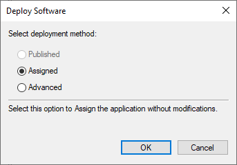

# LogZilla Windows Syslog Agent Group Policy (GPO) Deployment

* Ensure there is a suitable network share available. This network
share should be given **Read** access for the active
directory groups **Domain Computers** and **Domain Users**.  If there
is not one already, a new one should be created.  Ensure that
both the network share permissions and the file permissions are set
appropriately.

* Put the LogZilla_SyslogAgent_6.22.0.0 file in that share directory.

* On your Windows Server, start **Group Policy Management**.  This can
be accomplished by clicking on the Windows icon in the lower left,
then start typing "group policy management" during which Windows
will show you the program at the top left of the window, at which
point you would click on it.


* In Group Policy Management, left click down the treelist on the left
side until the appropriate *Organizational Unit* is reached.  This
would be the appropriate group within the *Active Directory* tree
that contains the machines chosen for the LogZilla installation. (See
screenshot below.)

* Right click on that OU.  A menu will appear, the top option of which
being `Create a GPO in this domain, and link it here`. Click on that
option.


* A `New GPO` window will appear.  In the `Name` box type the desired
policy name, then click `OK`.


* Now the new policy will appear as an item in the treelist on the left,
or in the window on the right. Right click on this and choose `Edit` (if a 
`Group Policy Management Console` window apperas, press `OK` to proceed).


* Then the **Group Policy Management Editor** window appears. In the
treelist on the left the new Policy should be at the top.  Expand
successively the options `Computer Configuration`, `Policies`,
`Software Settings`, at which point `Software installation` will
be shown. Right click on this and choose `New`, then `Package`.


* A file selection window will appear. Either type in the full
UNC path for the desired share (as above), or on the left
(important) navigate to the *Network* heading and expand
downwards to the desired directory there (do not go to the
directory on the local computer, if that is the source
for the network share).  Then type in or click the 
LogZilla_SyslogAgent_6.22.0.0 file, then push `Open`.


* Now the `Deploy Software` window appears.  `Assigned` should
be selected, if not then select it.  Then push `OK`.



* The deployment configuration is now complete.  The treelist
on the left should be expanded from the new policy at the 
top, then `Computer Configuration`, `Policies`, 
`Software Settings`, `Software installation`.  On the right
side will be shown an entry for `LZ Syslog Agent`.  This
indicates successful completion, and the open windows
can now be closed.


* At this point any member computers of the appropriate 
*Organizational Unit* (as chosen above) are set to install
LogZilla automatically upon reboot. Note that the GPO settings
on the desired computers must be refreshed before this
will happen. GPO settings will refresh automatically every 90
minutes.

* To force the GPO settings to refresh, the `gpupdate` command
can be used.  This must be done on the matchine that is the
desired target of the installation process. In a command window
type:
```
gpupdate /force
```


* When `gpupdate` is run, there will be a message indicating
one or more settings must be processed before the system start
or user logon. This is referring to the software installed by
GPO and is expected. Type `Y` to restart the computer. 

* The software will be installed on reboot. At the next logon
the `Syslog Configuration` icon will be present on the desktop,
and the service will be set to start automatically on the
subsequent reboot after that.  If activation of the service
without the next reboot being necessary is desired, the Windows
`SC` program can be used, as follows:
```
SC \\COMPUTERNAME start "LZ Syslog Agent"
```

where `COMPUTERNAME` is the name in Active Directory for the
desired computer.

